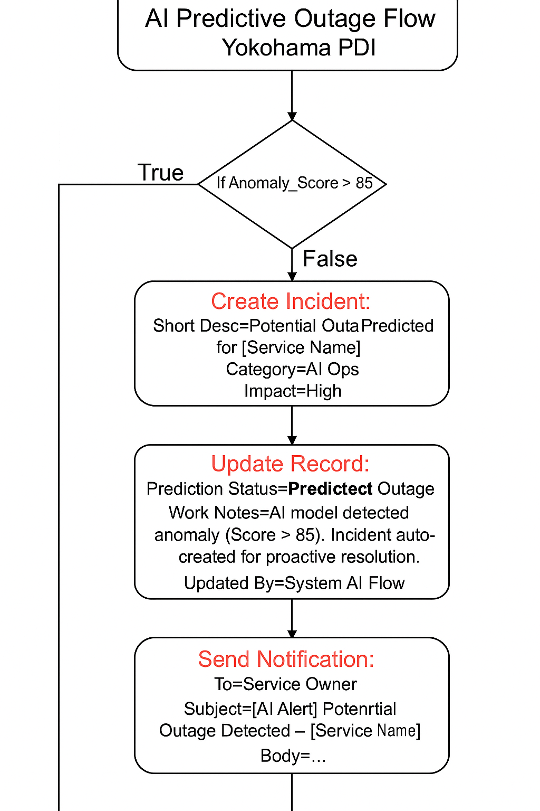

# ServiceNow_ITOM_Project1
Predictive Outage Prevention Flow (AIOps + AI)
# ITOM Project 1: Predictive Outage Prevention Flow (AIOps + AI)

### 🧠 Overview
This project simulates an AI-driven predictive outage prevention system in **ServiceNow (Yokohama PDI)**.  
It uses anomaly detection to automatically predict outages, create incidents, update records, and notify service owners proactively.

---

### ⚙️ Components Used
- **Module:** IT Operations Management (ITOM)
- **Plugins:** Event Management, Discovery, Predictive Intelligence
- **Table:** `AI Outage Events`
- **Flow Designer:** Trigger on record update
- **AI Condition:** If Anomaly Score > 85 → Predictive Outage

---

### 🧩 Flow Logic
1. **Trigger:** Record updated in `AI Outage Events`
2. **Condition:** If `Anomaly Score > 85`
3. **Action 1:** Create Incident
4. **Action 2:** Update AI Event record → Status = “Predicted Outage”
5. **Action 3:** Send Notification to Service Owner
6. **Optional:** Auto-remediation (Simulated restart)

---

### 🧪 Test Scenario
| Service Name | CPU Usage | Memory Usage | Anomaly Score | Expected Result |
|---------------|------------|---------------|----------------|----------------|
| App Server 01 | 88 | 84 | 95 | Incident auto-created |
| DB Server 02 | 60 | 70 | 72 | No incident triggered |

---

### 📸 Screenshots to Include
- Flow Designer overview (Trigger + Condition + Actions)
- Flow execution history
- AI Outage Event record (before and after)
- Incident created automatically

### 🧾 Evidence Diagram

---

### 🧭 Key Learning
- Applied **AIOps concept** using Flow Designer  
- Demonstrated **predictive automation** within ITOM  
- Simulated **AI collaboration with human response**  
- Ideal for roles like *AI Ops Engineer, Product Owner, or ServiceNow AI Automation Specialist*

---
